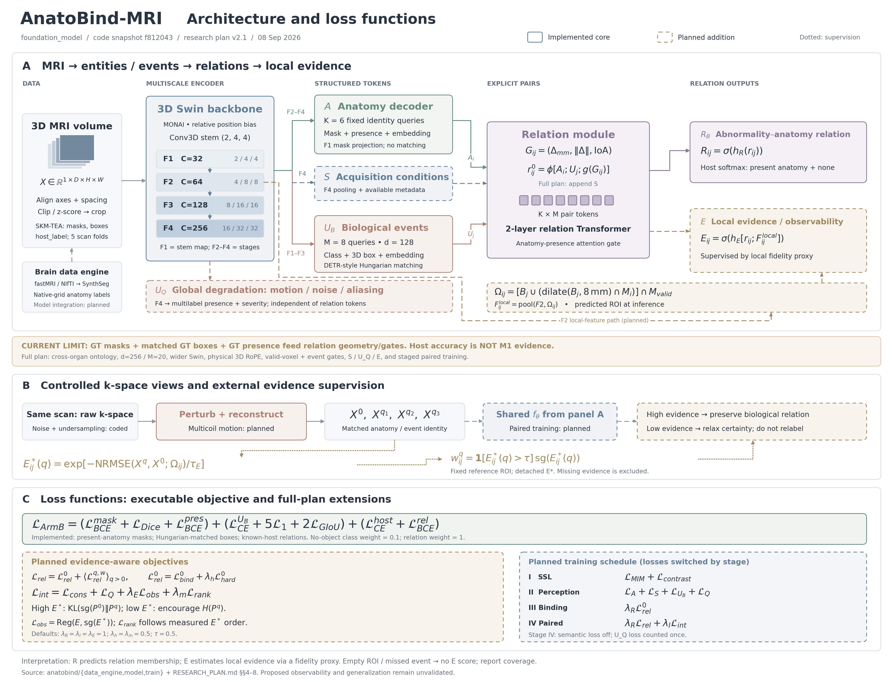

# foundation_model / AnatoBind-MRI：整体架构、损失与 novelty

核对日期：2026-09-08。代码基准：`f812043`；研究方案：`RESEARCH_PLAN.md` v2.1。

本说明区分当前可执行实现与研究目标。目录虽然名为 `foundation_model`，项目在现行方案中定位为 **3D MRI 结构化感知编码器 AnatoBind-MRI**；目前完成了数据引擎与 Arm-B 最小训练路径，不能据此称为已验证的 foundation model。

## PDF 阅读版：总图与逐模块说明

[打开 6 页 PDF](../output/pdf/anatobind_architecture_explained.pdf)。首图保持矢量，中文字体嵌入，附 6 个章节书签；每个子模块说明输入、处理、输出、相关 loss 或监督规则、实现状态和源码入口。16 个模块均补有浅绿色“通俗理解”，结合整理教材、固定名额、局部放大镜与分项扣分等具体例子说明模块作用；页首解释 token、query、mask、ROI、GT 等术语，末页保留公式并用通俗语言说明训练阶段与 novelty。

| 页码 | 内容 |
|---|---|
| 1 | 整体架构图、当前精确 loss 与完整方案目标 |
| 2 | 01 膝数据引擎；02 脑伪标签；03 预处理/采样；04 3D Swin |
| 3 | 05 解剖 A；06 采集 S；07 生物异常 U_B；08 全局退化 U_Q |
| 4 | 09 几何 G；10 关系 token/Transformer；11 关系与主宿主输出；12 局部 ROI |
| 5 | 13 关系证据 E；14 k-space 干预；15 匹配与监督路由；16 当前 loss/训练循环 |
| 6 | 四阶段 loss 开关、证据门控、novelty、验证边界与可点击文献 |

生成脚本：[render_architecture_guide_pdf.py](../scripts/render_architecture_guide_pdf.py)。已将全部 6 页渲染检查，核对公式、文字边界、中文字体与链接；总图没有栅格化。

```bash
/home/congcongliu/anaconda3/bin/python scripts/render_architecture_guide_pdf.py
```

## 一张总图



[SVG 可编辑矢量图](figures/anatobind_architecture_with_losses.svg) · [PDF](figures/anatobind_architecture_with_losses.pdf) · [PNG](figures/anatobind_architecture_with_losses.png) · [绘图脚本](figures/render_architecture_with_losses.py)

图中实线框表示已有核心模块；虚线框表示待实现分支；点线表示训练监督。模块旁的 K=6、M=8、d=128、通道 32/64/128/256 均对应当前实现；完整方案的参数与扩展另列。B 区的加噪、欠采数据生成已有代码，运动算子和配对训练尚未接入。C 区同时列出当前精确 loss 与完整方案的阶段损失。

## 1. 项目整体架构

完整研究目标：

\[
X\longrightarrow\{F^1,F^2,F^3,F^4\}
\longrightarrow(A,S,U_B,U_Q)
\longrightarrow R_B\longrightarrow E.
\]

最后一段是概念层次，实际 E 读取关系表示 `r_ij` 与局部图像特征，不是只读取 R 的标量分数。U_Q 是独立全局输出，不接入当前方案的关系 token，也不产生 R_Q。

| 层 | 责任与当前状态 | 代码入口 |
|---|---|---|
| 膝数据引擎 | SKM-TEA 混合域 k-space 重建、加噪、Poisson 欠采；分割/框对齐；宿主解析；重采样；五折划分 | [skmtea.py](../anatobind/data_engine/skmtea.py)、[skmtea_recon.py](../anatobind/data_engine/skmtea_recon.py)、[build_skmtea_m1.py](../scripts/build_skmtea_m1.py) |
| 脑数据引擎 | fastMRI H5/NIfTI 几何处理，调用 SynthSeg，标签回采到原生网格；尚未接入统一模型训练 | [fastmri.py](../anatobind/data_engine/fastmri.py)、[synthseg_pipeline.py](../anatobind/data_engine/synthseg_pipeline.py) |
| 训练数据适配 | 当前只读 SKM-TEA 第一回波干净图；XYZ→ZYX；百分位裁剪/z-score；病灶中心裁块；分割、框、间距同步变换 | [dataset.py](../anatobind/train/dataset.py) |
| 编码与解码 | 多尺度 Swin → 身份固定的解剖 queries + DETR 式异常 queries | [backbone.py](../anatobind/model/backbone.py)、[decoders.py](../anatobind/model/decoders.py) |
| 显式关系 | 解剖嵌入 + 异常嵌入 + 物理几何 → 配对 token → 两层 Transformer → 软关系/主宿主 | [relation.py](../anatobind/model/relation.py) |
| 模型与目标 | Hungarian 匹配、GT 几何构建、关系目标与总 loss | [armb.py](../anatobind/model/armb.py)、[losses.py](../anatobind/model/losses.py) |
| 训练入口 | AdamW、余弦学习率、梯度裁剪、BF16；最小路径 smoke run | [train_armb_minimal.py](../scripts/train_armb_minimal.py) |

### 当前模型具体怎么走

默认裁块为 `(B,1,64,128,128)`。Swin stem 为 `(2,4,4)`，采用 MONAI 相对位置偏置。当前 wrapper 删除最后一个 Swin stage；F1 是 patch embedding，尚未经过注意力，F2–F4 是前三个 stage 的合并后输出。

| 特征 | 当前形状，省略 B | 解码用途 |
|---|---|---|
| F1 | `32 × 32 × 32 × 32` | U_B 的细尺度 memory；A 的 mask 特征投影 |
| F2 | `64 × 16 × 16 × 16` | A/U_B memory；完整方案中的局部证据特征 |
| F3 | `128 × 8 × 8 × 8` | A/U_B memory |
| F4 | `256 × 4 × 4 × 4` | A memory；完整方案中的 S/U_Q 全局特征 |

解剖端 A 使用 6 个固定身份 query，分别对应髌骨软骨、股骨软骨、内/外侧胫骨软骨、内/外侧半月板。三层普通 cross-attention 依次读取 F4/F3/F2；query 与 F1 投影点积并上采样生成 mask，同时预测 presence。当前没有独立的 K+1 身份 CE 头，也没有完整 Mask2Former 的 mask-feedback attention。

异常端 U_B 使用 8 个 query，读取 F3/F2/F1，输出半月板撕裂、软骨病变、no-object 分类与归一化 3D 框，使用 Hungarian 匹配。两端 embedding 维数均为 128。

关系模块为每个 `(A_i,U_j)` 构建：

\[
G_{ij}=(\Delta z,\Delta y,\Delta x,\|\Delta\|,\mathrm{IoA}),\qquad
r^0_{ij}=\phi[A_i;U_j;g(G_{ij})].
\]

位移按逐卷 spacing 换算为 mm；几何计算停止梯度。两层配对 Transformer 产生关系表示，再用独立头输出关系 logits、主宿主 logits 与 none logit。`R` 在代码中存的是 logits，使用 sigmoid 后才是软关系概率。

**当前最重要的实现边界：**`ArmBMinimal.forward()` 把 GT 分割、GT 存在状态和 Hungarian 匹配后的 GT 框送进几何/门控。评估仍依赖这些标注，不是部署时仅凭图像的预测流程。当前 attention 仅按解剖 presence 屏蔽，尚未实现完整事件存在性门控；未匹配事件不产生关系监督，但仍可能参与注意力。

本地配置记录模型共 3,949,137 参数，骨干 1,758,212 参数。现有 300-step、fold-0 日志用于验证训练管线，不能作为“显式绑定优于 seg-then-lookup”的证据。

### 完整方案还要补什么

| 模块 | 研究目标 | 当前差距 |
|---|---|---|
| 变尺寸骨干 | 更宽的 3D Swin、物理坐标 RoPE、局部坐标、M_valid 传播 | 当前缩小骨干、相对位置偏置、统一批内裁块；没有完整 valid-voxel mask 路径 |
| 统一解剖本体 | 膝/脑固定并集 queries，区分存在、确认缺席、未知 | 当前仅膝 K=6；最终脑本体映射尚需固化 |
| S | 序列、场强、方向、脂肪抑制；条件化关系 | 尚未实现；元数据输入/监督泄漏策略仍需明确 |
| U_Q | motion/noise/aliasing 多标签 presence + 各自强度 | 尚未实现预测头；噪声与欠采生成已有实现，运动仍待实现 |
| E | 每个关系对的局部证据估计，使用固定参考 ROI 的保真度代理监督 | ROI 构建、E 头、E* 门控、回归/排序尚未实现 |
| 训练/评估 | SSL→感知→绑定→干预；预测几何评估、对照臂、组合泛化与真实退化测试 | 当前是干净膝裁块上的联合最小 loss，无上述阶段训练与主实验结果 |

数据引擎的现有 NRMSE 是整卷幅值图的记录量，不能直接当作每条关系的局部 E*；当前干净图来自数据集 target，退化图来自 adjoint-SENSE，需在生成 E* 时核对参考重建、强度尺度和有效域的一致性。

## 2. 图中的 loss：哪些已实现

当前精确组合，对应 `losses.py:134`：

\[
\begin{aligned}
\mathcal L_{\mathrm{ArmB}}
&=\underbrace{\mathcal L_{\mathrm{mask}}+\mathcal L_{\mathrm{presence}}}_{\mathcal L_A}
+\underbrace{\mathcal L_{\mathrm{cls}}+5\mathcal L_1+2\mathcal L_{\mathrm{GIoU}}}_{\mathcal L_{U_B}}\\
&\quad+\underbrace{\mathcal L_{\mathrm{host\ CE}}+\mathcal L_{\mathrm{relation\ BCE}}}_{\mathcal L_{\mathrm{rel}}},\qquad\lambda_R=1.
\end{aligned}
\]

这里是当前版本的 L_rel，没有 hard-negative 对比项或 E* 加权。图中把 L_mask 展开成 BCE + Dice。

解剖 mask 只对裁块内存在的结构计算。设 `p_bk` 为 GT presence，`V` 为裁块体素数，`s_bkv = sigmoid(mask_logits_bkv)`：

\[
\mathcal L_{\mathrm{mask}}=
\frac{\sum_{b,k}p_{bk}\left[\frac1V\sum_v\mathrm{BCE}(s_{bkv},y_{bkv})+
1-\frac{2\sum_v s_{bkv}y_{bkv}+1}{\sum_v s_{bkv}+\sum_v y_{bkv}+1}\right]}
{\max(\sum_{b,k}p_{bk},1)}.
\]

存在性项对全部 B×K 槽计算二元 BCE。实现使用 `binary_cross_entropy_with_logits`，上式用概率写法便于阅读。

异常检测对全部 query 计算 weighted CE，no-object 类权重 0.1；仅对 Hungarian 匹配的实例计算 L1/GIoU。L1 是每个框六个坐标的绝对误差之和，再除以匹配实例数；不能误写为六坐标额外求均值。匹配代价为 `−P(class) + 5 × L1 − 2 × GIoU`。

主宿主 CE 在 K+none 候选上归一化，仅监督已匹配且宿主已知的事件。关系 BCE 对这些事件与实际存在的解剖计算正/负配对。未知宿主和未匹配事件被排除，不当成负类；当前训练集仅纳入 `in_seg` 实例，没有把积液当作 none 正样本训练。

### 完整方案的证据监督与阶段目标

局部配对区域同时用于特征池化与 E* 计算：

\[
\Omega_{ij}=[B_j\cup(\mathrm{dilate}(B_j,8\ \mathrm{mm})\cap M_i)]\cap M_{\mathrm{valid}},
\qquad E_{ij}=\sigma\big(h_E[r_{ij};\mathrm{pool}(F^2,\Omega_{ij})]\big).
\]

配对训练固定参考 mask/box/ROI 并停止梯度；推理使用当前图预测 ROI，没有干净参考。空 ROI、漏检、缺席实体属于无评分状态，不编码为 E=0。8 mm 为待验证默认值。

\[
E^*_{ij}(q)=\exp\left[-\frac{\mathrm{NRMSE}(X^q,X^0;\Omega_{ij})}{\tau_E}\right],
\qquad w^q_{ij}=\mathbf1[E^*_{ij}(q)>\tau]\,\operatorname{sg}(E^*_{ij}(q)).
\]

`sg` 表示停止梯度。τ=0.5 是关系监督门限；τ_E 是保真度标度，二者不同。方案尚未固化局部 NRMSE 的最终实现及 τ_E 定标数据，不能把 τ_E 填成 0.5。图中的 E* 是研究定义，而非当前管线已有输出。

\[
\begin{aligned}
\mathcal L_{\mathrm{sem}}&=\mathcal L_A+\mathcal L_S+\mathcal L_{U_B}+\mathcal L_Q,\\
\mathcal L_{\mathrm{rel}}^0&=\mathcal L_{\mathrm{bind}}^0+\lambda_h\mathcal L_{\mathrm{hard}}^0,\\
\mathcal L_{\mathrm{rel}}&=\mathcal L_{\mathrm{rel}}^0+
\operatorname{mean}_{q>0}\mathcal L_{\mathrm{rel}}^{q,w},\\
\mathcal L_{\mathrm{int}}&=\mathcal L_{\mathrm{cons}}+\mathcal L_Q+
\lambda_E\mathcal L_{\mathrm{obs}}+\lambda_m\mathcal L_{\mathrm{rank}}.
\end{aligned}
\]

L_Q 为退化类型 BCE + 有标签强度的回归。L_cons 在高证据时对齐干净/退化关系分布，干净分支 detach；低证据时关闭确定性监督与 KL，并鼓励熵增。图中 KL 的 teacher→student 写法用于表达这一目标；最终 KL 方向、概率截断和熵权重仍需实现时固化。

L_obs 回归同一 ROI 的 E*；L_rank 只在同一干预族与固定 ROI 上，按实测 E* 的排序约束 E。方案未指定回归范数、排序形式/margin、hard-negative loss 的具体形式，所以图使用 `Reg` / `L_rank` / `L_hard`，不把任意 L1/MSE/hinge 写成已定设计。

| 阶段 | 实际应开启的完整方案目标 |
|---|---|
| I：SSL | L_MIM + L_contrast；预训练形式尚待实现 |
| II：结构化感知 | L_sem = L_A + L_S + L_UB + L_Q |
| III：干净关系绑定 | λ_R L_rel⁰ |
| IV：干预与可观测性 | λ_R L_rel + λ_I L_int；L_sem 关闭，L_Q 只计算一次 |

默认 `λ_R=λ_I=λ_E=1`，`λ_h=λ_m=0.5`，`τ=0.5`，尚无调参结果。

门控需保留三条实现约束：多标签 BCE 按配对加权；宿主 CE 按整条事件、使用真实主宿主的证据加权，不能在 softmax 前缩放各类 logits；硬负对使用正负配对权重的较小值。低证据不改变关系标签，也不改成 none。按有效标注数归约，不能除以权重和而抵消降权；未知或无 E* 的项既没有确定性监督，也不获得熵奖励。

## 3. Novelty 判断

**最有潜力的贡献是：以物理干预产生的局部证据作为外部监督，训练“何时维持异常–解剖关系、何时降低判断确定度”。目前是待验证的方法贡献。**

普通 3D Swin/医学 SSL 已有成熟工作，例如 [Swin UNETR 的自监督预训练](https://arxiv.org/abs/2111.14791)；通用 MRI 表征也已有 [MRI-CORE](https://arxiv.org/abs/2506.12186)。因此不能以“使用 3D Transformer、多任务头或 MRI 预训练”作为主要新颖性。

| 候选贡献 | 实质与前作边界 | 必须补的证据 |
|---|---|---|
| **N1：关系级、局部证据估计** | 为每个异常–解剖对预测 E；其监督来自固定局部 ROI 上的配对保真度。已有 [ConfidNet](https://github.com/valeoai/ConfidNet) 学习模型置信度/失效预测；本方案的区别应落在外部物理代理、关系粒度和跨退化迁移，而不是“多加一个 confidence head” | 相同预测 ROI 下对比 learned failure prediction、关系置信度、熵、全局/局部质量；报告失效预测、覆盖率及未见退化表现。证明 E* 与关系失效确实有关 |
| **N2：证据门控的配对干预学习** | A/U_B 的生物内容固定；高证据关系保持，U_Q 响应施加的退化，E 跟随证据变化；低证据允许不确定。价值在这些目标的联合约束 | 同样的退化图、标注与 E* 监督规则下比较普通增广；分别消融一致性、U_Q、E 和门控；增加真实退化测试 |
| **N3：面向 3D MRI 的显式实体关系与组合评估** | 固定身份解剖 token、异常实例 token、物理几何与采集条件共同编码关系；关注 anatomy×abnormality×degradation 的未见组合。一般关系 Transformer 已有 [SGTR](https://arxiv.org/abs/2112.12970)，解剖–发现关系标注已有 [Chest ImaGenome](https://arxiv.org/abs/2108.00316)；新意应是 MRI 场景中与 N1/N2 的组合及效果 | 相同骨干/参数/监督下对比 seg-then-lookup、配对 MLP、multi-task 模型；独立 held-out 组合；拆分组织族与内外侧评估 |

这是一轮针对关键近邻的定向核查，不是系统性穷尽检索；不支持“全球首次”“无人做过”的表述。表中差异是依据项目方案与这些前作作出的分析判断，并非已完成的对照实验。

### 可用于介绍的贡献表述

中文：

> 我们提出一个面向 3D MRI 的证据感知解剖–异常关系学习框架，将异常实例与解剖实体显式绑定，并利用受控 k-space 干预构建关系局部证据监督：证据充分时保持生物关系，证据不足时降低关系判断的确定度。

英文：

> We propose evidence-aware anatomy–abnormality relation learning for 3D MRI, coupling explicit entity–event binding with local evidence supervision derived from controlled k-space perturbations. The framework preserves biological relations when evidence is sufficient and relaxes deterministic supervision when local evidence is degraded.

以上是方法提案表述。当前不能追加“显著提升”“已验证跨器官泛化”“临床可靠性”或“因果可识别”等结果性结论。

### 对 novelty 影响最大的当前风险

1. **GT 几何捷径。** 当前训练可通过 IoA 学习接近查表的宿主规则。必须使用预测 mask/box/presence 完成主评估，并让对照臂拿到相同上游预测与监督。
2. **侧别监督不是完全独立人工真值。** 组织族来自 tissue_id，部分内/外侧由 GT 分割重叠解析。应分开报告组织族与侧别，对 ambiguous/unresolved 单列；不能宣称整个关系标签完全独立于 overlap。
3. **局部保真度不等于关系可判别性。** NRMSE 升高不保证特定关系已不可判断；反之细小关键证据可能丢失但总体 NRMSE 很低。E* 与真实错误的联系需验证，不能直接把 E 当成已校准的正确概率。若报告 ECE/Brier，应说明目标事件与是否经过独立验证集上的概率校准。
4. **当前缺少关键实现和公平主实验。** S/U_Q/E、运动、配对训练、参考/预测 ROI 对照、seg-then-lookup 对照臂与 held-out 组合尚未完成。已有代码主要证明可训练性，最强 novelty 仍在设计阶段。

建议优先完成预测几何版本与同上游预测的 seg-then-lookup 对照，在现有噪声/欠采梯度下测绑定差异；随后检验局部 E* 是否能预测失效，再接入 E 和配对目标。主指标应包含漏检，不只统计成功匹配子集；按扫描/受试者处理多病灶和多退化视图的相关性。

## 4. 交付与验证记录

- 图类型：`internal_review`，单张完整架构审阅图；不冒充已验证论文结果。
- 输入依据：现有代码、方案、数据引擎说明与本地训练配置；没有绘制合成性能数值。
- 生成脚本：[render_architecture_with_losses.py](figures/render_architecture_with_losses.py)。样式依据 figure-polish 的学术样式资产做了可携带适配。
- 导出：SVG、单页 PDF、4400×3360 PNG；SVG 保留文本可编辑。
- 实际渲染检查后修订：缩短超出模块边界的标题；移开穿过事件模块的 F2 旁路；补脑侧数据管线和 E*→门控的监督箭头；区分关系预测与证据代理。
- 代码核验：现有 loss、关系、模型测试共 **34 passed**；没有重新训练模型，也没有修改训练/模型代码。

```bash
MPLCONFIGDIR=/tmp/anatobind-mplconfig PYTHONNOUSERSITE=1 \
  /home/congcongliu/anaconda3/envs/nvgen/bin/python \
  docs/figures/render_architecture_with_losses.py

PYTHONNOUSERSITE=1 PYTHONPATH=. OMP_NUM_THREADS=2 MKL_NUM_THREADS=2 \
  /home/congcongliu/anaconda3/envs/nvgen/bin/python -m pytest \
  tests/test_armb_losses.py tests/test_armb_relation.py tests/test_armb_model.py \
  -q -p no:cacheprovider
```
